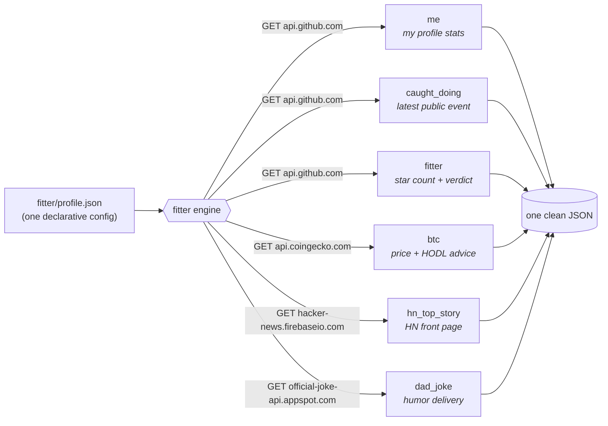

### Hi there 👋


- 👯 I'm currently Backend Engineer at Epic Games
- 🔭 I'm currently working on [Fitter](https://github.com/PxyUp/fitter) — web data for AI agents
- 😄 Love dunks, football, basketball
- 📫 [Twitter](https://twitter.com/PXYUP) | [Telegram](https://t.me/pxyup)

### 🕵️ Don't just read this README — scrape it live

> [!TIP]
> Every link below opens the **[fitter playground](https://pxyup.github.io/fitter/)** — my scraping engine compiled to WebAssembly — and runs a **real scrape in your browser**. No install, no backend, no API keys: the whole config travels inside the URL.

| | Live scrape | What comes back |
|---|---|---|
| 🔎 | **[Fact-check this profile](https://pxyup.github.io/fitter/?q=1.vVTLasMwEPwVobObtFdD21PptZT2JjCyvI6VypLQrvMg-N-LbNLYifswhZyk3RlpZrViD1zxlB-EZUxwTVALnrIujAnlrAVFLmTK2VKvBmCEA6B3FiGjvYeICb5GZwVPTpwmmB6piDymy6X0erHSVDX5Qrl62SAEXL7s9u9-dA4hbGBSN6I1UOWK_uLnpzfBj2Dbb9rkWELtCjBnvl2-BkXf3V1qMAWepSNgZQ0X6QjkEiHrjk3AkXB6H6Sg7WpQ6YnkJVU9qRcaM9ph2CZjZ1sXPjCTdBV3ytVe2v0sg77JjVZZAO8uX3amSW3pF4djtRk2S2eM20K4gseB1AyDGwiFVv_u8yx7E7wVWAiSYFqpmxzSqMb8QPnjx-uJsPMBEHWcLZ27V0D2cM_ubm_ZIxNCcAWBdKmhYNqWpgGrIMQ8SztYBtIorTQJw1oac5NLUhXrq4zKQvDzRlw0YyIxbtYp-Noe51FcWmFbnnDNU87bTw)** | my stats straight from the GitHub API, plus an honest `verdict` field |
| 👨‍💻 | **[Catch me coding](https://pxyup.github.io/fitter/?q=1.vVNNb4MwDP0rUU6bhMrOSNVO1a7VtGmXSCgEA-kgiWLTD1X89ylEFS1l1U7jAn7v2X6OyZkrnvGzMIwJrgk6wTM2hgFQ1hhQZH2urKl0fUUG2gM6axByOjkInOA7tEbwZNL0vo1MQ-QwS1Pp9KrW1PTFStku7RE8ptvj6dOlsAdDmLq-aLW6qYLg97DoIrAdUGPL2OZt8yH4hRzix5BcBupsCe1sClvsQNFvtSsNbYkzeDwb2dcN5aXVZp4VBYVEyMf0BToIplND8mOV5F7kJDVR9LKKCQuiGgx4SbDcKbptVd8-kPzRUBTC0XlA1GHXQV69A7L1mgkh-LbHZhMWGQL2OmKux0abmilbwghn7Ok650uSuktCkj64YB6cRaYNEsiS2YodrP8O9mKlUOh52vn0DHNoBtyEQ3K73tD0n9YaWq2M7GA-xEODhwbMPxlUHsKfk0t67HAKhvkNDK9BmIEnXPOM8-EH)** | my latest public GitHub event, red-handed |
| ⭐ | **[Should you star fitter?](https://pxyup.github.io/fitter/?q=1.pVPNTsMwDH6VKOdqHddKwAlxRQhukaosddtMaRLFybQyVeIheEKeBKVl6tqVn8Epsb_P9uc4PlBBM3pgmhBGpYeG0Yz0ZnQIozUIb1wujC5ldQJG2AFaoxFy31qIGKNbNJrRZOQEpwak9t5ilqbcylUlfR02K2Ga1IE1mD7s22ebltJ7cJNwBLeDxfIRbcDXphjy3989MXoEu-HSJcdOGlOAmsk3my0I_1XuUoIqcOaOgHUmxp0hEdtwhLyPXIAjYXwp9E7q6qTZkwrc1wOpDErlmjcwtjZp8NNIpgrRc3eu_EJ9UvsfxMUyFX8Bh7kwIdIv0ViboIq8NSGPeXL57wf9i-AFegUaHPewXLDfCq5EUN9QfjnogQh76wBRxr3pR_4ISG6uydV6vSa3hLH4UXfSBFRtNEjW-1pA8v76RqQnQgF3qiUaoEDSmhDx-TDOBrLgmA5sNLr5WsWjY7qjCZU0o7T7AA)** | a live, data-driven, completely unbiased answer |
| 📉 | **[Free financial advice](https://pxyup.github.io/fitter/?q=1.xVPBSsQwFPyVkIOnshX1VFj3ouhBEMRjoGST1zZrmoS8tChL_13S7tpttwpe9JTMm0nevAnZU0EzumeGEEZVgJrRjPQwFoQ1BkSwPhfWFKo8ISPtAZ01CHn4cBA5RndoDaPJqGm8HpgqBIdZmnKnVsIqU4J4syth61hJ2-sUVe00pM4rARslcb1VIQovWsxF4z0YoQDXDcoLZYRuJORXN5XPRcVNCevgG5h0RvAtLDqPbA2hsnKw9nD_yuiR7IZNlxxDqK0EPZvcbncgwnd3Fwq0xFk5Etsg8gblGdNzHCHvTy7QUTCGXGjLw8mso8bxUA2aQ3irvt1U2J3CLplaHNKMyf6xy9jy8Ja_Muy8LQBRWcN1zmWrBPyn84VDJRjwPMBy4z50rkWjf5BM_WHwypQLvQYhvDs_JHIY5wWQ3JJLsiGMMfr4fPcUV5J9QVJxL8FHOM_-LP-FwvR9RtDN_1RcOmY6mlBFM0q7Tw)** | real-time BTC through my proprietary algorithm: `change > 0 ? "HODL" : "HODL harder"` |
| 🥁 | **[Emergency dad joke](https://pxyup.github.io/fitter/?q=1.vZI9bsMwDIWvYnB2kt170At0FGAoMh0rlUVBog0EgYaepFPv1yMUihP4Jw7QDu1kkd8z-UjpAgoKuAibZQI0YyugyK5hSiiyFhWTLxXZWh8nMGGPwZENWPLZYWICToGsgHzUdN4MpGF2odjtqK610tJsTvSGG-n0VjoXHPFWUbvz0lbUlonNygT0Pa7aSLRFbqga-rzsXwXcYRwOMb9P1FKFZjEGHU6o-FntWqOpwiI9WOLOPeQTOciA5fW_FZwE474Ce22Pk1FHkZPc3ERDp7kkTsOYz725zqrGaIv_4m_S7RceKzS6R3_-Q4tHtOgl43qR6yWyZK2e4B_2GYS9NN1NeZBZ1bUZh5B9fXy-L7fysJmVxHxzYxCXLzt9orARctBQAMRv)** | fetched, parsed and strongly typed — enterprise-grade humor delivery |

<details>
<summary>🧐 How the magic works (yes, this section is collapsible — GitHub said we could)</summary>

<br>

Each link carries a declarative [fitter](https://github.com/PxyUp/fitter) config, deflate-compressed into the `?q=` parameter. The playground decodes it and the **real Go engine** — the same code as the fitter CLI and MCP server, compiled to WASM — executes it entirely client-side. This is the "fact-check this profile" config:

```json
{
    "item": {
        "connector_config": {
            "response_type": "json",
            "url": "https://api.github.com/users/PxyUp",
            "server_config": {
                "method": "GET"
            }
        },
        "model": {
            "object_config": {
                "fields": {
                    "name": {
                        "base_field": {
                            "type": "string",
                            "path": "name"
                        }
                    },
                    "works_at": {
                        "base_field": {
                            "type": "string",
                            "path": "company"
                        }
                    },
                    "public_repos": {
                        "base_field": {
                            "type": "int",
                            "path": "public_repos"
                        }
                    },
                    "followers": {
                        "base_field": {
                            "type": "int",
                            "path": "followers"
                        }
                    },
                    "verdict": {
                        "base_field": {
                            "type": "int",
                            "path": "followers",
                            "generated": {
                                "calculated": {
                                    "type": "string",
                                    "expression": "fRes >= 100 ? \"certified influencer\" : \"artisanal, small-batch following\""
                                }
                            }
                        }
                    }
                }
            }
        }
    }
}
```

Want your own? Build a config in the [playground](https://pxyup.github.io/fitter/), hit **Share**, paste the link anywhere. LLMs can author these configs too — that's the whole point: [fitter is an MCP server](https://github.com/PxyUp/fitter#how-to-use-fitter_mcp), so Claude can scrape the web for you, locally.

</details>

### 🔬 Live fitter showcase — every block below is one declarative config, and you can run each one

**Act 1 · The output, live.** These values are fetched the moment you load this page — click any line to execute the matching [fitter](https://github.com/PxyUp/fitter) scrape yourself, in your browser:

<br>
[](https://pxyup.github.io/fitter/?q=1.xVPBSsQwFPyVkIOnshX1VFj3ouhBEMRjoGST1zZrmoS8tChL_13S7tpttwpe9JTMm0nevAnZU0EzumeGEEZVgJrRjPQwFoQ1BkSwPhfWFKo8ISPtAZ01CHn4cBA5RndoDaPJqGm8HpgqBIdZmnKnVsIqU4J4syth61hJ2-sUVe00pM4rARslcb1VIQovWsxF4z0YoQDXDcoLZYRuJORXN5XPRcVNCevgG5h0RvAtLDqPbA2hsnKw9nD_yuiR7IZNlxxDqK0EPZvcbncgwnd3Fwq0xFk5Etsg8gblGdNzHCHvTy7QUTCGXGjLw8mso8bxUA2aQ3irvt1U2J3CLplaHNKMyf6xy9jy8Ja_Muy8LQBRWcN1zmWrBPyn84VDJRjwPMBy4z50rkWjf5BM_WHwypQLvQYhvDs_JHIY5wWQ3JJLsiGMMfr4fPcUV5J9QVJxL8FHOM_-LP-FwvR9RtDN_1RcOmY6mlBFM0q7Tw)<br>
[](https://pxyup.github.io/fitter/?q=1.pVPNTsMwDH6VKOdqHddKwAlxRQhukaosddtMaRLFybQyVeIheEKeBKVl6tqVn8Epsb_P9uc4PlBBM3pgmhBGpYeG0Yz0ZnQIozUIb1wujC5ldQJG2AFaoxFy31qIGKNbNJrRZOQEpwak9t5ilqbcylUlfR02K2Ga1IE1mD7s22ebltJ7cJNwBLeDxfIRbcDXphjy3989MXoEu-HSJcdOGlOAmsk3my0I_1XuUoIqcOaOgHUmxp0hEdtwhLyPXIAjYXwp9E7q6qTZkwrc1wOpDErlmjcwtjZp8NNIpgrRc3eu_EJ9UvsfxMUyFX8Bh7kwIdIv0ViboIq8NSGPeXL57wf9i-AFegUaHPewXLDfCq5EUN9QfjnogQh76wBRxr3pR_4ISG6uydV6vSa3hLH4UXfSBFRtNEjW-1pA8v76RqQnQgF3qiUaoEDSmhDx-TDOBrLgmA5sNLr5WsWjY7qjCZU0o7T7AA)<br>
[](https://pxyup.github.io/fitter/?q=1.vVTLasMwEPwVobObtFdD21PptZT2JjCyvI6VypLQrvMg-N-LbNLYifswhZyk3RlpZrViD1zxlB-EZUxwTVALnrIujAnlrAVFLmTK2VKvBmCEA6B3FiGjvYeICb5GZwVPTpwmmB6piDymy6X0erHSVDX5Qrl62SAEXL7s9u9-dA4hbGBSN6I1UOWK_uLnpzfBj2Dbb9rkWELtCjBnvl2-BkXf3V1qMAWepSNgZQ0X6QjkEiHrjk3AkXB6H6Sg7WpQ6YnkJVU9qRcaM9ph2CZjZ1sXPjCTdBV3ytVe2v0sg77JjVZZAO8uX3amSW3pF4djtRk2S2eM20K4gseB1AyDGwiFVv_u8yx7E7wVWAiSYFqpmxzSqMb8QPnjx-uJsPMBEHWcLZ27V0D2cM_ubm_ZIxNCcAWBdKmhYNqWpgGrIMQ8SztYBtIorTQJw1oac5NLUhXrq4zKQvDzRlw0YyIxbtYp-Noe51FcWmFbnnDNU87bTw)<br>
[](https://pxyup.github.io/fitter/?q=1.vVNNb4MwDP0rUU6bhMrOSNVO1a7VtGmXSCgEA-kgiWLTD1X89ylEFS1l1U7jAn7v2X6OyZkrnvGzMIwJrgk6wTM2hgFQ1hhQZH2urKl0fUUG2gM6axByOjkInOA7tEbwZNL0vo1MQ-QwS1Pp9KrW1PTFStku7RE8ptvj6dOlsAdDmLq-aLW6qYLg97DoIrAdUGPL2OZt8yH4hRzix5BcBupsCe1sClvsQNFvtSsNbYkzeDwb2dcN5aXVZp4VBYVEyMf0BToIplND8mOV5F7kJDVR9LKKCQuiGgx4SbDcKbptVd8-kPzRUBTC0XlA1GHXQV69A7L1mgkh-LbHZhMWGQL2OmKux0abmilbwghn7Ok650uSuktCkj64YB6cRaYNEsiS2YodrP8O9mKlUOh52vn0DHNoBtyEQ3K73tD0n9YaWq2M7GA-xEODhwbMPxlUHsKfk0t67HAKhvkNDK9BmIEnXPOM8-EH)<br>
[](https://news.ycombinator.com)<br>
[](https://pxyup.github.io/fitter/?q=1.vZI9bsMwDIWvYnB2kt170At0FGAoMh0rlUVBog0EgYaepFPv1yMUihP4Jw7QDu1kkd8z-UjpAgoKuAibZQI0YyugyK5hSiiyFhWTLxXZWh8nMGGPwZENWPLZYWICToGsgHzUdN4MpGF2odjtqK610tJsTvSGG-n0VjoXHPFWUbvz0lbUlonNygT0Pa7aSLRFbqga-rzsXwXcYRwOMb9P1FKFZjEGHU6o-FntWqOpwiI9WOLOPeQTOciA5fW_FZwE474Ce22Pk1FHkZPc3ERDp7kkTsOYz725zqrGaIv_4m_S7RceKzS6R3_-Q4tHtOgl43qR6yWyZK2e4B_2GYS9NN1NeZBZ1bUZh5B9fXy-L7fysJmVxHxzYxCXLzt9orARctBQAMRv)<br>
<br>

**Act 2 · The run — built on the fly.** This is not a committed image. When you loaded this page, a headless browser opened [`live.html`](https://pxyup.github.io/fitter/live.html) on my GitHub Pages, the **real fitter engine** (Go → WASM) fetched the configs from this repo, scraped all sources and rendered this terminal — and you're looking at the photo of it (rebuilt roughly hourly). Click it to watch it build in front of you:

[](https://pxyup.github.io/fitter/live.html)


**Act 3 · The pipeline.** This diagram is not hand-drawn — it's generated from the config by [`scripts/render_blocks.mjs`](scripts/render_blocks.mjs):

<!-- fitter:pipeline:start -->

<!-- fitter:pipeline:end -->

**Act 4 · The map.** Every `connector_config` host in the profile config, plotted — zoom in, click the dots:

<!-- fitter:map:start -->
```geojson
{
  "type": "FeatureCollection",
  "features": [
    {
      "type": "Feature",
      "properties": {
        "name": "fitter runs here (or in YOUR browser)",
        "role": "Berlin"
      },
      "geometry": {
        "type": "Point",
        "coordinates": [
          13.405,
          52.52
        ]
      }
    },
    {
      "type": "Feature",
      "properties": {
        "name": "api.github.com",
        "role": "connector for \"me\" (San Francisco)"
      },
      "geometry": {
        "type": "Point",
        "coordinates": [
          -122.419,
          37.775
        ]
      }
    },
    {
      "type": "Feature",
      "properties": {
        "name": "api.coingecko.com",
        "role": "connector for \"btc\" (Singapore)"
      },
      "geometry": {
        "type": "Point",
        "coordinates": [
          103.85,
          1.29
        ]
      }
    },
    {
      "type": "Feature",
      "properties": {
        "name": "hacker-news.firebaseio.com",
        "role": "connector for \"hn_top_story\" (Mountain View)"
      },
      "geometry": {
        "type": "Point",
        "coordinates": [
          -122.084,
          37.422
        ]
      }
    },
    {
      "type": "Feature",
      "properties": {
        "name": "official-joke-api.appspot.com",
        "role": "connector for \"dad_joke\" (Mountain View)"
      },
      "geometry": {
        "type": "Point",
        "coordinates": [
          -122.084,
          37.422
        ]
      }
    },
    {
      "type": "Feature",
      "properties": {
        "name": "connector requests"
      },
      "geometry": {
        "type": "MultiLineString",
        "coordinates": [
          [
            [
              13.405,
              52.52
            ],
            [
              -122.419,
              37.775
            ]
          ],
          [
            [
              13.405,
              52.52
            ],
            [
              103.85,
              1.29
            ]
          ],
          [
            [
              13.405,
              52.52
            ],
            [
              -122.084,
              37.422
            ]
          ],
          [
            [
              13.405,
              52.52
            ],
            [
              -122.084,
              37.422
            ]
          ]
        ]
      }
    }
  ]
}
```
<!-- fitter:map:end -->

<details>
<summary>📊 …and the obligatory human stats (live too, but I'm not the product here)</summary>

<br>


</details>

<sub>Nothing here needs a server or a cron job: the JSON lines are image proxies over live APIs, the diagrams and the map are rendered by GitHub from text that fitter's output generated, and the real engine runs client-side as WASM when you click. What the playground authored today can become your [MCP tool](https://github.com/PxyUp/fitter#how-to-use-fitter_mcp) tomorrow.</sub>

### My projects:

- ⚡ [Fitter](https://github.com/PxyUp/fitter) | [DEMO](https://pxyup.github.io/fitter/) - turn any website or API into structured JSON, declaratively. MCP server included, so AI agents can fetch web data locally [https://github.com/PxyUp/fitter](https://github.com/PxyUp/fitter)
- ⚡ [Squzy](https://squzy.app/) | [DEMO](https://demo.squzy.app/) - high-performance open-source monitoring, incident and alert system  [https://github.com/squzy](https://github.com/squzy)
- ⚡ [Revact](https://pxyup.github.io/Revact/) - Lightweight replacement of React + MobX + React Router. [https://github.com/PxyUp/Revact](https://github.com/PxyUp/Revact)
- 📫 [This is bounce!](https://apps.apple.com/app/this-is-bounce/id1546411963) - Game on Swift (Using sprite kit)

### My articles

- [ENG] [Create Go Monorepo with Go-modules and Bazel](https://medium.com/@tduble94/create-go-monorepo-with-go-modules-and-bazel-95f00cf571d3)
- [ENG] [How I Wrote a Javascript Framework](https://levelup.gitconnected.com/how-i-wrote-javascript-framework-59b40dca3366)
- [ENG] [Virtual scroll table for Angular 7](https://medium.com/@tduble94/virtual-scroll-table-for-angular-7-bb26f8dd48a)
- [RUS] [Real-Time игры и кроссдоменное соединение](https://habr.com/en/post/276159/)
- [RUS] [Squzy — бесплатная open-source self-host система мониторинга с инцидентами и уведомлениями](https://habr.com/ru/post/512452/)

### My competitions:
 - [Telegram Instant View Contest (2017) - 2nd place](https://instantview.telegram.org/contest/winners2017)
